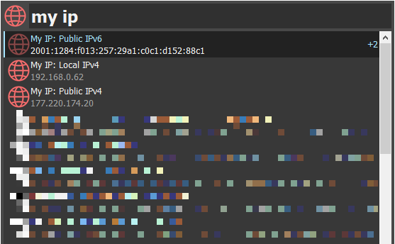

# Keypirinha Plugin: MyIPExtended

This is MyIPExtended, a plugin for the
[Keypirinha](http://keypirinha.com) launcher.

Get your public and local IPs (v4 and v6) directly from Keypirinha.

This is a fork from [keypirinha-myip](https://github.com/Fuhrmann/keypirinha-myip)

## Download
https://github.com/Fuhrmann/keypirinha-myip/releases/latest
https://github.com/andriykrefer/keypirinha-myip/releases/latest

## Install

### Via PackageControl
[@ueffel](https://github.com/ueffel) wrote [PackageControl](https://github.com/ueffel/Keypirinha-PackageControl), a package manager that eases the install of third-party packages.

MyIpExtended is on PackageControl repository

### Manually
First download [MyIpExtended here](https://github.com/andriykrefer/keypirinha-myip/releases/latest).

Once the `MyIpExtended.keypirinha-package` file is downloaded,
move it to the `InstalledPackage` folder located at:

* `Keypirinha\portable\Profile\InstalledPackages` in **Portable mode**
* **Or** `%APPDATA%\Keypirinha\InstalledPackages` in **Installed mode** (the
  final path would look like
  `C:\Users\%USERNAME%\AppData\Roaming\Keypirinha\InstalledPackages`)

## Usage

Open Keypirinha and type 'ip' or 'my ip'. Your local iPv4 and public IPv4 and IPv6 will appear on Keypirinha's catalog. Press `ENTER` to copy.

When your network settings change, you can press `ENTER` on any "My IP" item to refresh the IP addresses.

## Differences from MyIP

MyIpExtended is a fork from MyIP. Its main changes are:

- Add IPv4 and IPv6 items (original chooses one automatically)
- Manual refresh. Original refreshes everytime you type "ip". MyIpExtended only refreshes when you press `ENTER` on an item, rebuild its catalog or it detects a network change.
- New item description ("My IP" in the place of "Your IP")

## License
This package is distributed under the terms of the MIT license.

## Attribution
Networking icon created by [Corner Pixel - Flaticon](https://www.flaticon.com/free-icons/networking)
